# Streaming Parallel Chain Dataflow

This document visualizes the complete data flow for the Developmental Companion's Streaming Parallel Chain architecture.

## System Architecture Overview

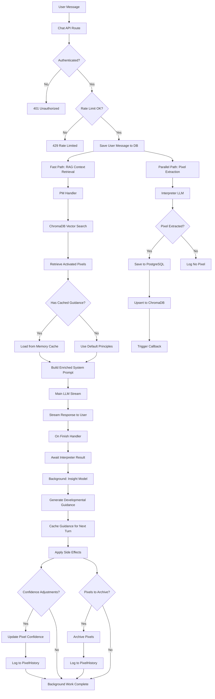

## Detailed Component Flows

### 1. RAG Context Retrieval (Fast Path - 200-500ms)

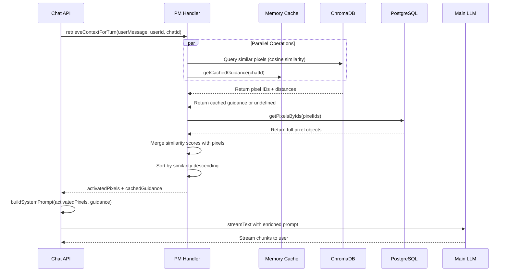

### 2. Pixel Extraction (Parallel Path - Non-blocking)

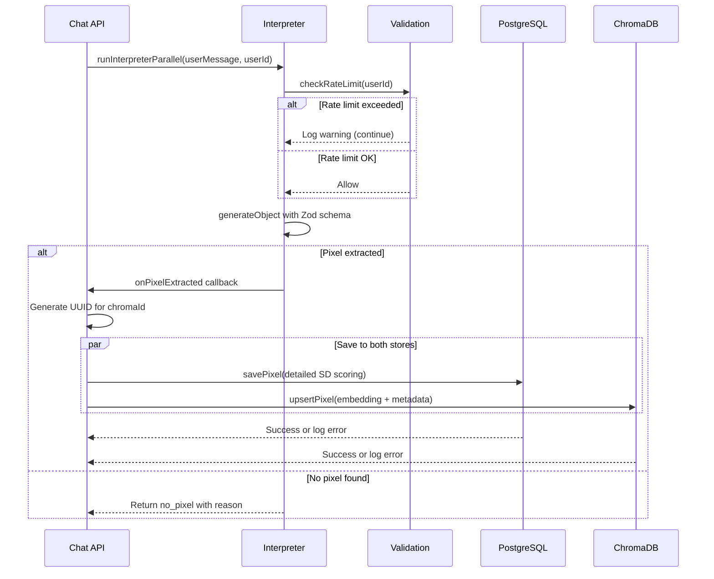

### 3. Insight Analysis (Background - Async)

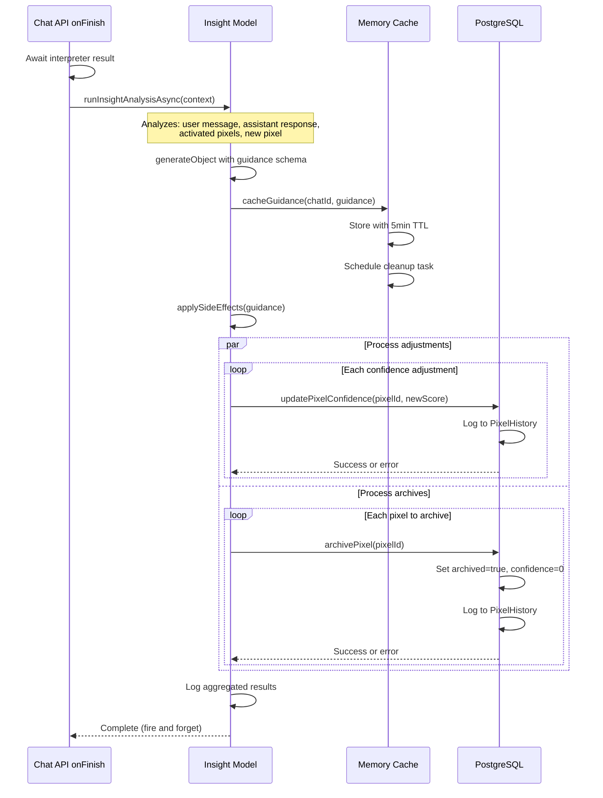

## Data Models

### Pixel Structure (Database)

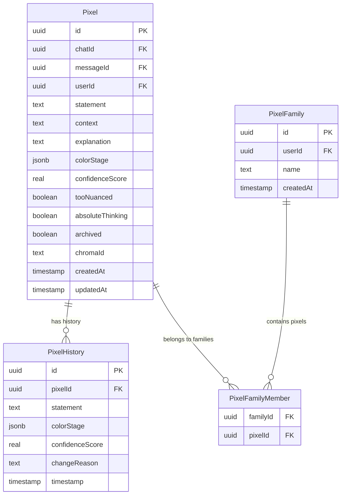

### Spiral Dynamics Color Stage Scoring

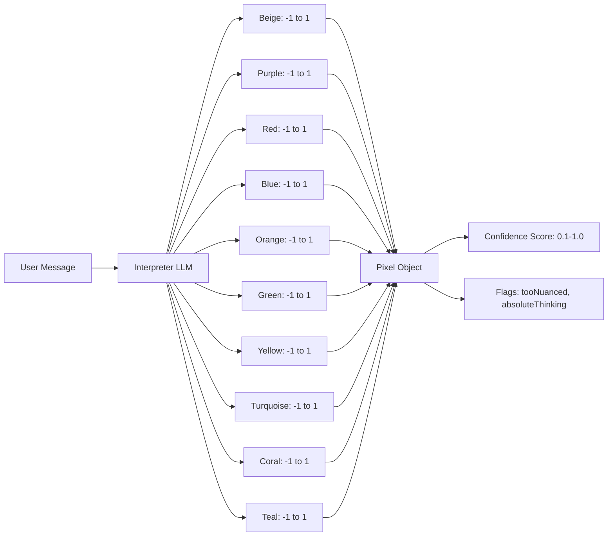

## Error Handling & Resilience

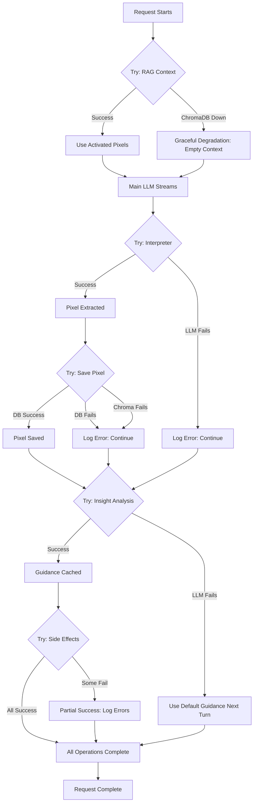

## Performance Characteristics

### Latency Profile

```mermaid
gantt
    title Request Timeline (Target: 2-3s perceived latency)
    dateFormat X
    axisFormat %Ls

    section User Experience
    User sends message           :0, 0
    First token arrives          :milestone, 2000
    Full response complete       :0, 3000
    
    section Fast Path (Critical)
    RAG context retrieval        :0, 400
    Build enriched prompt        :400, 100
    Main LLM TTFT                :500, 1500
    Stream to completion         :2000, 1000
    
    section Parallel Path (Non-blocking)
    Interpreter starts           :100, 2000
    Pixel extraction complete    :2100, 0
    Save to DB and Chroma        :2100, 300
    
    section Background (Async)
    Insight analysis starts      :3000, 3000
    Guidance generated           :6000, 0
    Side effects applied         :6000, 500
    All background work done     :6500, 0
```

## Cache Strategy

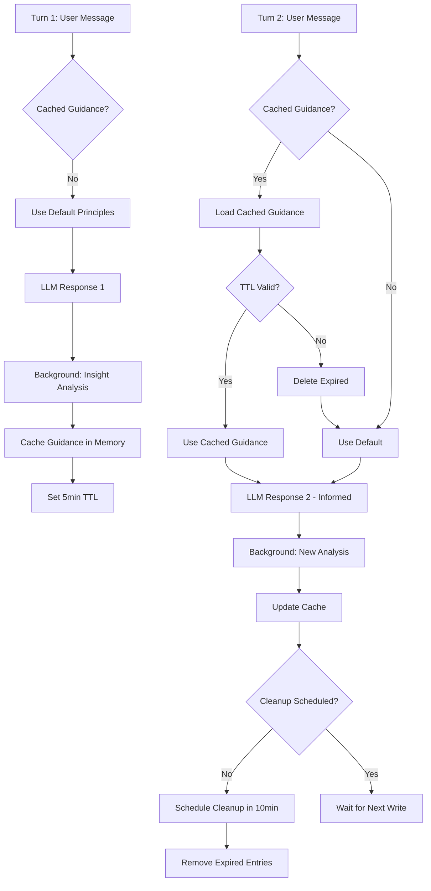

## Security & Validation

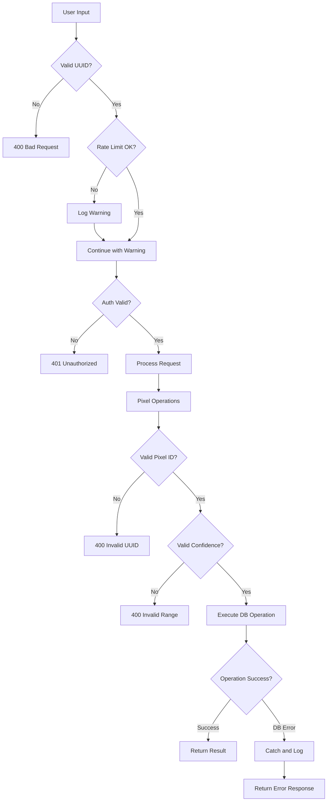

## Production Deployment Considerations

### Required Environment Variables

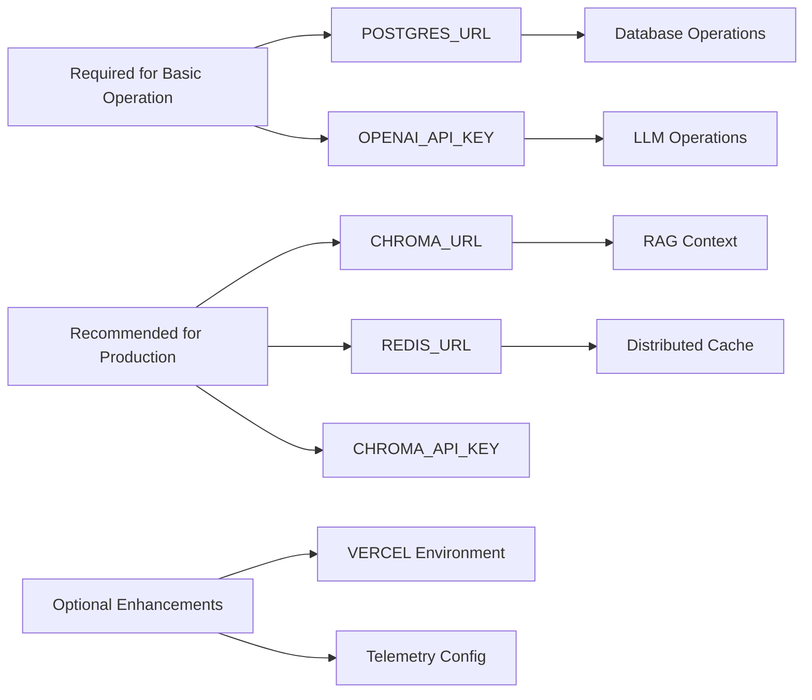

---

## Legend

- **Solid lines**: Synchronous operations (blocking)
- **Dashed lines**: Asynchronous operations (non-blocking)
- **Diamonds**: Decision points
- **Rectangles**: Process steps
- **Parallelograms**: Input/Output
- **Cylinders**: Data stores (not shown in all diagrams due to Mermaid limitations)

## Notes on Implementation

1. **Fast Path Priority**: RAG context retrieval is optimized for speed (200-500ms target) to minimize TTFT
2. **Graceful Degradation**: All external dependencies (ChromaDB, Redis) fail gracefully
3. **Fire and Forget**: Background analysis doesn't block user experience
4. **Cache Strategy**: In-memory with TTL for demo; Redis recommended for production
5. **Error Boundaries**: Every async operation wrapped in try-catch with appropriate fallbacks
6. **Rate Limiting**: In-memory tracking; move to Redis for multi-instance deployments

